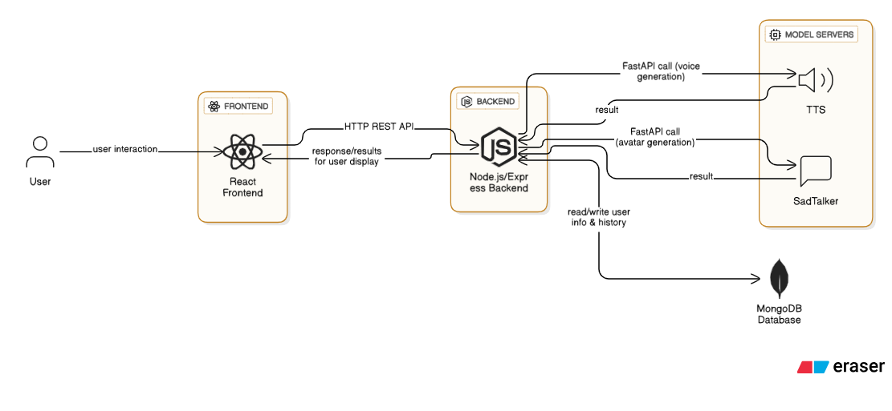
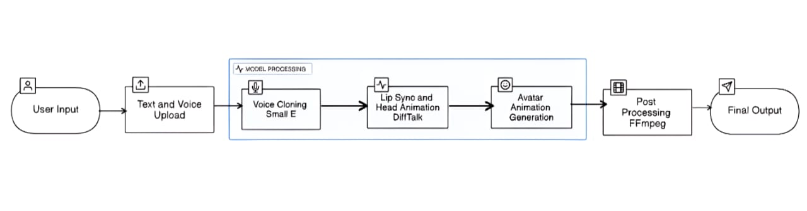

# AvatarLab-G432-PS25
An end-to-end system that generates **AI-driven avatars** by combining **voice cloning** and **talking head video generation** using advanced open-source models.
## 🧩 Architecture & Workflow




---

## 🎬 Output Videos

- 🔹 [Sample Video 1](./samples/output1.mp4)
- 🔹 [Sample Video 2](./samples/output2.mp4)


---

## 🧩 Features

- Upload text and your voice sample to clone your voice.
- Upload an image or selfie to animate using your voice.
- Backend integration with:
  - `StyleTTS2` for **voice cloning**
  - `SadTalker` for **talking head generation**
- Video generation using **FFmpeg**
- JWT-based user authentication
- MongoDB storage for user and video history
- Fully functional frontend using React + TypeScript

---

## 🧪 Tested Models (TTS + Video Generation)

We tested 10+ models for both speech synthesis and talking head video generation:

| Model Name | Type            | Status | Notes                                |
|------------|-----------------|--------|--------------------------------------|
| StyleTTS2  | TTS             | ✅ Used | High quality, fast                   |
| SadTalker  | Video           | ✅ Used | Stable, open-source                  |
| XTTTS      | TTS             | ❌ emotion |                                      |
| Coqui TTS  | TTS             | ❌ Poor quality |                              |
| OpenVoice  | TTS             | ❌ Unstable |                                      |
| Bark       | TTS             | ❌ Very slow |                                      |
| Small-E    | TTS             | ❌ Experimental |                                  |
| Tortoise TTS | TTS             | ❌ Slow, GPU required |                      |
| DiffTalk   | Video           | ❌ Expired checkpoints |                         |
| PC-AVS     | Video           | ❌ Model complexity |                          |
| DreamTalker | Video           | ❌ mid quality |                            |
| Memo       | Video           | ❌ Output quality low |                        |
| AniTalker  | Video           | ❌ Unrealistic movements |                       |

🧠 **Why We Chose StyleTTS2 + SadTalker?**
🧑‍🎤 **StyleTTS2**: lightweight, great output even without GPU
🎥 **SadTalker**: better control of facial movements, easy integration
⚡ **Other models were either:**
- Too large for CPU inference
- Poor in quality
- Had dependency or checkpoint errors

---

## 🛠️ Tech Stack

- Frontend: React + TypeScript + Tailwind
- Backend: Node.js + Express
- Model Server: FastAPI (Python)
- Database: MongoDB
- Video Processing: FFmpeg

---

## 🌐 Deployment

| Layer         | Tool / Platform          |
|---------------|--------------------------|
| Frontend      | Vercel                   |
| Backend       | Render                   |
| Model Server  | Localhost / Cloud VM     |
| Storage       | Local folders (temp)     |

---

## 👨‍💻 Team Members (Alphabetical Order)

- Abhishek Kumar
- Anand Sai
- Hrushikesh Sai
- Samuel
- Sowmith
- Yashwanth

---

## 📂 Folder Structure (Sample)

```bash
/AvatarLab
│
├── /client               # React frontend
├── /server               # Express backend
├── /model-server         # FastAPI + models
├── /samples/outputs      # Generated avatar videos 
└── README.md